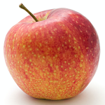

# What is PngBin?
The name **PngBin** comes from an image format file extension **PNG** (**P**ortable **N**etwork **G**raphics) and the word **Bin**ary. An image produced by PngBin will have every property like a normal PNG image except that when viewed by an image viewer, It will appear broken and noisy (which is normal for any PngBin images). By utilizing the lossless data compression feature, A PNG image can be made to contain arbitrary *binary* data (this is why PngBin image can look noisy) without losing a single bit of information, Unlike JPEG image, which has lossy compression and cannot reverse its data to the original form.

|||
|-|-|
| Normal PNG Image | PngBin Image Example |

# Why is PngBin?
There are a few fun applications I can think of while working on this project. One of which is you can make most image hosting act like a file hosting by loading your files (video, music, executable, pdf, etc.) or even images to a PNG image using PngBin, then upload those loaded images to the image hosting. This method uses the advantages of most image hosting, like direct link and high speed download, to access your file easier and faster than any average free file hosting. Or you can upload them to a site where posting arbitrary files is impossible and only images (especially PNG images) are allowed.
> Visit these [Jupyter notebooks](notebooks) for this application demo.  
> Live demo example can be visited [here](https://pngbindemo.theyoke.repl.co)

The possibility is there and it's up to you to decide. And of course, contribution is appreciated.

# How is PngBin?
It's fine, thanks for asking. JK 😝  
As mentioned above, In general, PngBin can load any data to a PNG image file which makes almost all the images it produces look broken and noisy unlike normal PNG images which only allow a relatively small subset of binaries to be contained so that the image would make sense.

There are 2 main classes, `Writer` which converts any binary data to an PngBin image and `Reader` which does the opposite. These 2 classes also have their corresponding extensions `EncryptWriter` and `DecryptReader`, respectively. They are used to obscure/reveal data inside PngBin images with AES cipher. All the previously mentioned classes can convert a single image at a time which can be inconvenient in some cases, that's why `ChainWriter` and `ChainReader` are made to convert your data and split/join the images into/from multiple small images.

# Requirements
- Python 3.6+
- cryptography (Write/Read Encrypted PngBin images)
- flask, requests (WebUI)
- httpx (Uploader)
- jupyterlab (For running Jupyter notebooks)

# Usage
Look for usage, examples and more details on [Jupyter notebooks demo](notebooks).  

The following video demonstrates an example of how PngBin is used.  

