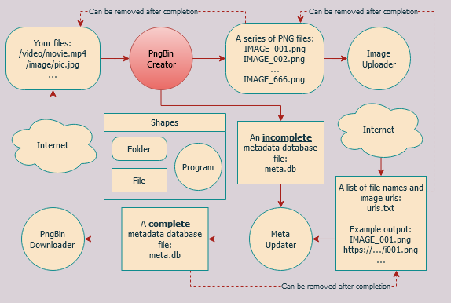
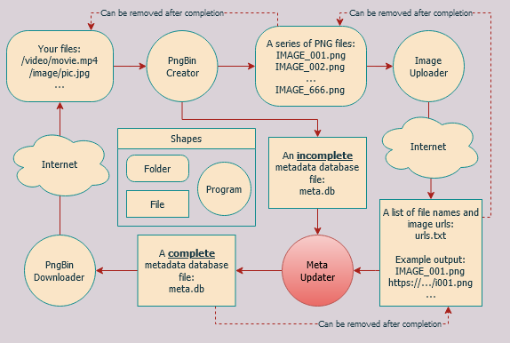
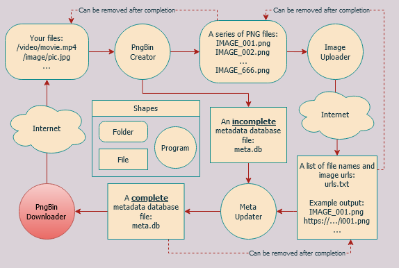

# PngBin File Server Demo.
These notebooks are created to demonstrate a use case of PngBin by turning [most](#note-on-step-2) image hosting into a simple secret file server. This tutorial will help you go through the basic steps.  
 
There are 4 main steps.

## 1. Generating PngBin images



By using [creator.ipynb](creator.ipynb) you can convert a whole directory of files into a series of PngBin images and a corresponding metadata database file (`meta.db`).
> You may start [JupyterLab](https://jupyter.org/) with `PYTHONPATH` environment variable as this repo's root path.

## 2. Upload your newly created images to image hosting


Choose one of the available notebooks to upload your images to, or create your own python module and notebook to upload to image hosting of your choice.  
This step also produces a list of uploaded image urls (`urls.txt`).
> Currently available notebooks are:
> - [flickr.ipynb](uploader/flickr.ipynb) (Requires an account)  
> - [postimages.ipynb](uploader/postimages.ipynb)

## 3. Add the list of image urls to metadata database file



Once your upload is done, you can use `urls.txt` file from the last step to update a previously incomplete `meta.db` file by using [updater.ipynb](updater.ipynb)

## 4. Download your stuff back



Whenever you (or anyone who has `meta.db` file) want the original files back, you can download them by using [Explorer WebUI](../webui/explorer).  
To start, navigate to this repo's root directory and run the below command:
```
python -m webui.explorer -m XXX
```
Where `XXX` is the path to metadata database file (e.g. meta.db).  
After that, using your browser and go to http://127.0.0.1:8080.
> Live demo example can be visited [here](#)

---
---

### Note on [step 2](#2-upload-your-newly-created-images-to-image-hosting)
If you choose to create your own python module and upload to a different image hosting, that hosting must have the following requirements:
- Must allow [hotlinks](https://en.wikipedia.org/wiki/Inline_linking) or direct links to image files.
- Must allow [partial content](https://en.wikipedia.org/wiki/Byte_serving) requesting of image files.
